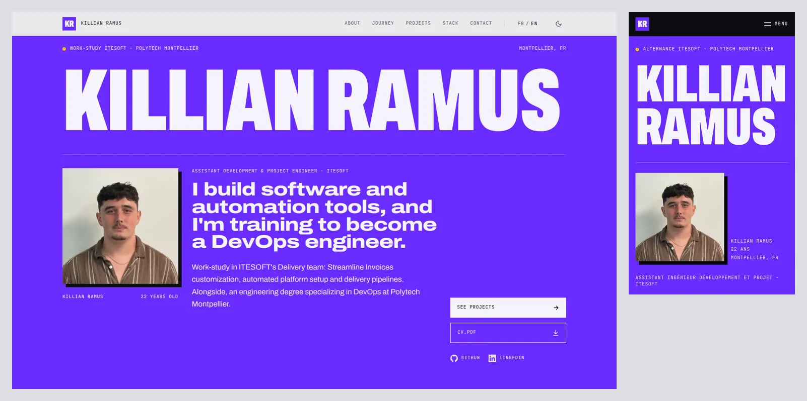

# Killian Ramus · Portfolio

[](https://github.com/killianrms/portfoliov2/actions/workflows/ci.yml)
[](https://killianrms.com)

Personal portfolio of Killian Ramus, assistant development and project engineer in a work-study program at ITESOFT, and engineering student specializing in DevOps at Polytech Montpellier.

**Live:** [killianrms.com](https://killianrms.com) (English) · [killianrms.com/fr](https://killianrms.com/fr) (French)



## Stack

- **Framework:** Next.js 16 (App Router), React 19, TypeScript
- **Styling:** Tailwind CSS 4, Archivo (variable width axis) and JetBrains Mono via `next/font`
- **Contact form:** API route + Resend
- **Analytics:** Vercel Web Analytics (cookieless)
- **CI:** GitHub Actions (lint, typecheck, dependency audit, build, Playwright end-to-end tests)
- **Hosting:** Vercel

## Highlights

- **Bilingual URLs:** English at `/`, French at `/fr`. Pages live under `src/app/[lang]` and root paths are rewritten to `/en` in `next.config.ts`. Each page has its own `lang`, canonical, hreflang alternates and Open Graph image; the sitemap lists both languages.
- **Fully prerendered:** every page, project and language is static HTML; no section waits for a scroll to appear. Code samples are highlighted at build time, so project pages ship no highlighting JavaScript.
- **Theme without flash:** light/dark applied by an inline script before first paint, following the device setting until the visitor chooses.
- **Security:** Content-Security-Policy and hardening headers; the contact form uses a honeypot, a minimum fill time, a per-IP rate limit and server-side validation, and escapes all input.
- **Accessibility:** skip link, keyboard-friendly lightbox with focus trap, `aria-pressed` filters, contrast checked in both themes, reduced motion respected.

## Getting started

```bash
npm install
npm run dev          # http://localhost:3000
```

| Script | What it does |
|---|---|
| `npm run lint` | ESLint |
| `npm run typecheck` | TypeScript, no emit |
| `npm run build` | Production build |
| `npm run test:e2e` | Playwright tests against the production build (run `npm run build` first; `npx playwright install chromium` once) |

## Project structure

```
src/
  app/[lang]/    # Pages (home, projects, legal), layout, Open Graph image
  app/api/       # Contact form endpoint
  components/    # Sections and UI
  context/       # Language and theme
  data/          # Projects, education/experience, UI strings
  lib/           # i18n helpers, dates, French typography
tests/e2e/       # Playwright tests
scripts/         # CV generator
```

Content lives in `src/data/`: `projects.ts` (project write-ups), `journey.ts` (education and experience), `translations.ts` (interface text).

## CV

The CVs (`public/cv-en.pdf`, `public/cv-fr.pdf`, and `public/cv.pdf`, a French copy kept for links already shared but not linked from the site) are generated by `scripts/build_cv.py` in a single-column, ATS-friendly layout with clickable contact links:

```bash
pip install reportlab
python scripts/build_cv.py
```

## Environment variables (Vercel)

| Variable | Required | Purpose |
|---|---|---|
| `RESEND_API_KEY` | yes | Sends contact form messages |
| `CONTACT_FROM` | no | Sender on a domain verified in Resend, e.g. `Portfolio <contact@killianrms.com>`. Defaults to Resend's test sender `onboarding@resend.dev`. |

## Deployment

Pushes to `main` deploy automatically on Vercel.
